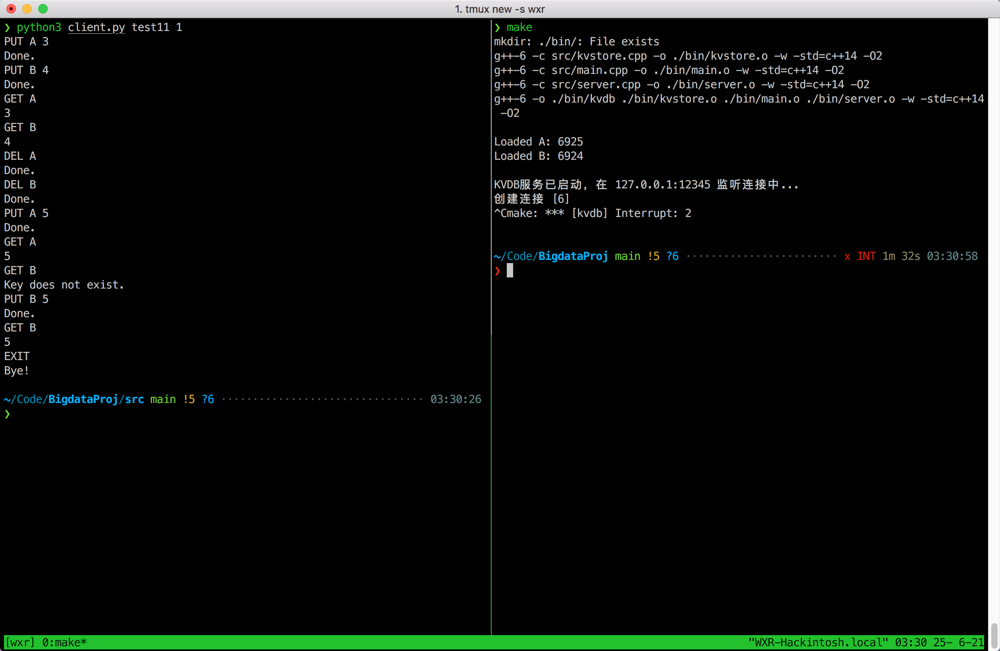
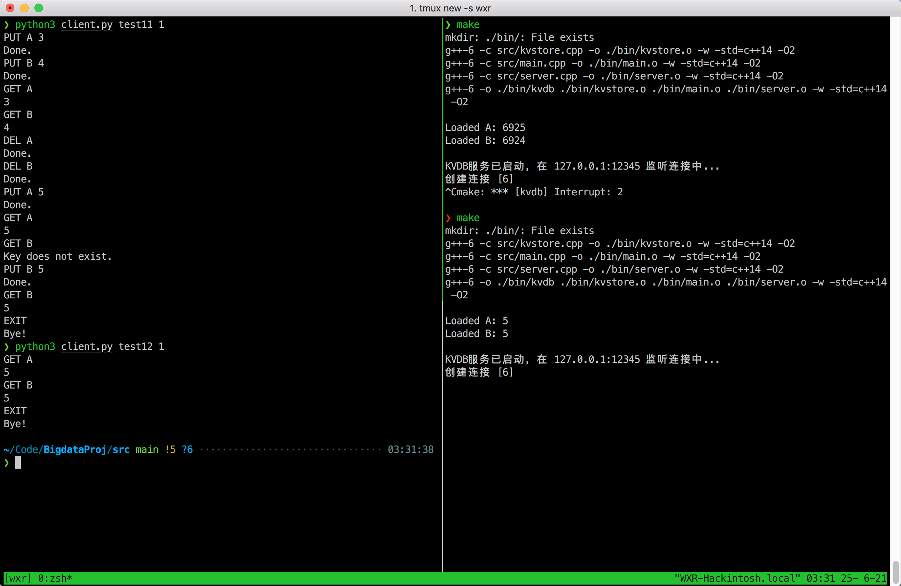
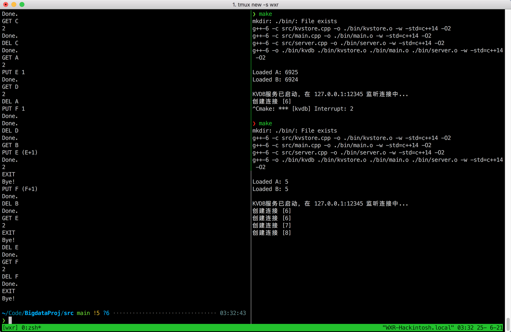
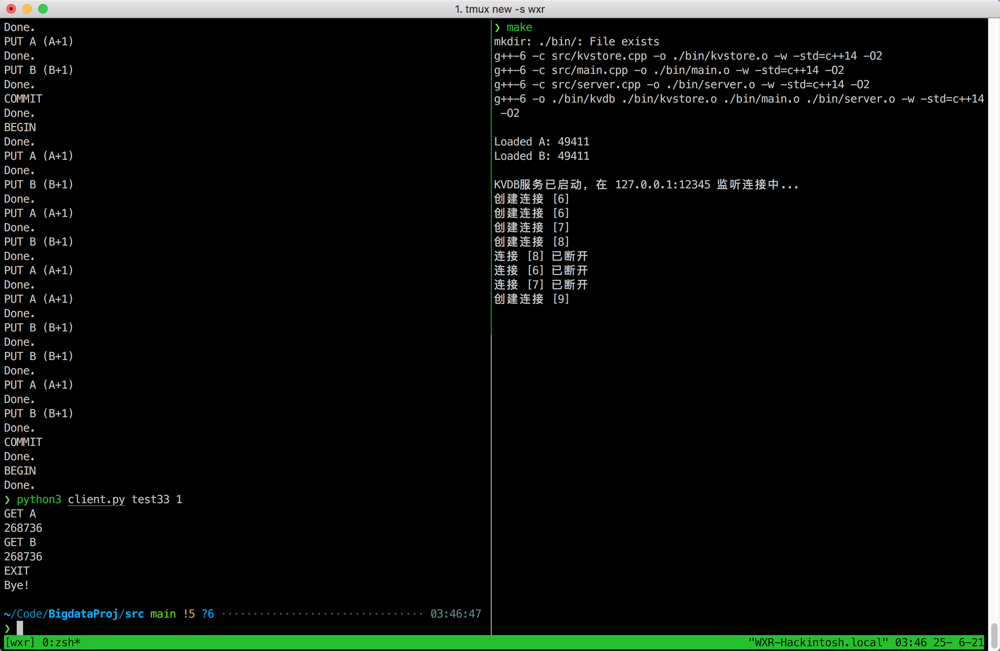

# KVDB大作业实验报告
王宣润 2020215219

## 实现的功能
- ⽀持插⼊、删除、查找
- ⽀持 ACID 特性
- ⽀持并发
- ⽀持磁盘

## 运行方式
### server
在项目根目录下

    > make
### client
由于server已经做好了命令的parse，可以直接利用telnet输入命令

    > telnet 127.0.0.1 12345

也可以参考`src/client.py`和`src/tests.py`中的代码来测试。

## 达到的性能效果
### 正确性验证

### 性能

在保证ACID特性的情况下，1分钟内，作业要求中的ACID测试可以使A，B达到268736。

## 实现细节
本项目中，为了实现的方便，key的长度有上限，value限制为int。
### 如何进行CRUD和磁盘落盘
在内存里保存一份kv的值，同时保证磁盘上的kv和内存里的时刻保证同步。每次操作修改了内存里的kv，都要如实全面地反映到磁盘上去。这样即使重启服务，也可以从磁盘文件中获取到最新的kv。为了提高磁盘IO速度，我采用二进制文件读写、以及C中fseek函数等方式，把每次读写的区域限制在了很小的范围内，故基本都可以命中磁盘的缓存，在保证ACID的情况下效率很高。

具体的，我把每个key的信息：key名、它的value在数据文件中的偏移量、它是否被删除这三个信息保存在一条记录中，然后把所有key的这些记录都保存在一个二进制文件里。每当变更一个key的时候都会把对应的信息更新到这个文件中去。我把每个key对应的value值也保存在另一个二进制文件里，使其和内存的值保持同步。

### 如何实现ACID特性
我采用了比较简单粗暴的方式，通过互斥锁保证了一个时刻只能访问一个kv，并且当有Trans正在进行的时候，不允许其他Trans开始或修改某个kv。另外，还针对Trans保留了修改日志，一旦出现ABORT或者客户端掉线，就从日志中还原这个Trans里进行的修改。这就保证了原子性。

### 如何实现并发
同上，采用的是互斥锁的方式。

## 改进
由于学艺不精，我并没有实现多版本和MVCC的相关技术。这部分存在改进空间。
以及每次操作都落盘实际上对效率还是有影响的，可以考虑降低落盘频率。
恢复日志并没有考虑ACID，如果在故障恢复时出现程序崩溃，可能会破坏ACID性质。
可以加入分布式的支持。